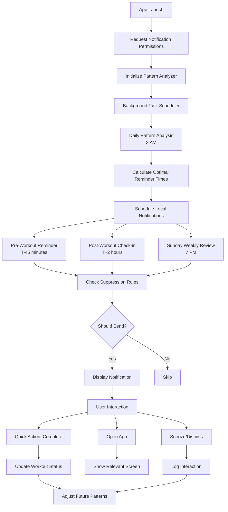

# Proactive Messaging System Flow

## System Architecture Diagram



## Notification Infrastructure Implementation

### 1. Core Notification Manager

```swift
import UserNotifications
import BackgroundTasks

class ProactiveNotificationManager: NSObject {
    static let shared = ProactiveNotificationManager()
    
    private let patternAnalyzer = WorkoutPatternAnalyzer()
    private let suppressor = MessageSuppressor()
    private let notificationCenter = UNUserNotificationCenter.current()
    
    // MARK: - Setup
    
    func requestPermissions() async -> Bool {
        do {
            let granted = try await notificationCenter.requestAuthorization(
                options: [.alert, .badge, .sound, .provisional]
            )
            if granted {
                await setupNotificationCategories()
                scheduleBackgroundTasks()
            }
            return granted
        } catch {
            print("Notification permission error: \(error)")
            return false
        }
    }
    
    private func setupNotificationCategories() async {
        // Pre-workout category
        let completeAction = UNNotificationAction(
            identifier: "COMPLETE_WORKOUT",
            title: "Mark Complete",
            options: [.foreground]
        )
        
        let snoozeAction = UNNotificationAction(
            identifier: "SNOOZE_REMINDER",
            title: "Remind in 30 min",
            options: []
        )
        
        let preWorkoutCategory = UNNotificationCategory(
            identifier: "PRE_WORKOUT",
            actions: [completeAction, snoozeAction],
            intentIdentifiers: []
        )
        
        // Post-workout category
        let logAction = UNNotificationAction(
            identifier: "LOG_WORKOUT",
            title: "Log Workout",
            options: [.foreground]
        )
        
        let skipAction = UNNotificationAction(
            identifier: "SKIP_WORKOUT",
            title: "Skipped Today",
            options: []
        )
        
        let postWorkoutCategory = UNNotificationCategory(
            identifier: "POST_WORKOUT",
            actions: [logAction, skipAction],
            intentIdentifiers: []
        )
        
        notificationCenter.setNotificationCategories([
            preWorkoutCategory,
            postWorkoutCategory
        ])
    }
}
```

### 2. Pattern Analysis System

```swift
class WorkoutPatternAnalyzer {
    private let calendar = Calendar.current
    private let scheduleManager = TrainingScheduleManager.shared
    
    struct TimePattern {
        let dayOfWeek: DayOfWeek
        let typicalTime: DateComponents
        let variance: TimeInterval // in minutes
        let sampleSize: Int
    }
    
    func analyzePatterns(from workoutHistory: [WorkoutDay]) -> [TimePattern] {
        // Group workouts by day of week
        let grouped = Dictionary(grouping: workoutHistory.filter { $0.completed }) { 
            $0.dayOfWeek 
        }
        
        var patterns: [TimePattern] = []
        
        for (day, workouts) in grouped {
            // Extract completion times from notes or actualWorkout timestamps
            let times = extractWorkoutTimes(from: workouts)
            
            if times.count >= 2 { // Need at least 2 data points
                let avgTime = calculateAverageTime(times)
                let variance = calculateTimeVariance(times, average: avgTime)
                
                patterns.append(TimePattern(
                    dayOfWeek: day,
                    typicalTime: avgTime,
                    variance: variance,
                    sampleSize: times.count
                ))
            }
        }
        
        return patterns
    }
    
    private func calculateAverageTime(_ times: [DateComponents]) -> DateComponents {
        // Calculate average hour and minute
        let totalMinutes = times.reduce(0) { sum, time in
            sum + (time.hour ?? 0) * 60 + (time.minute ?? 0)
        }
        let avgMinutes = totalMinutes / times.count
        
        return DateComponents(hour: avgMinutes / 60, minute: avgMinutes % 60)
    }
}
```

### 3. Smart Scheduling Logic

```swift
extension ProactiveNotificationManager {
    
    func scheduleSmartReminders() {
        Task {
            // Cancel existing reminders
            notificationCenter.removeAllPendingNotificationRequests()
            
            // Get workout patterns
            let patterns = patternAnalyzer.analyzePatterns(
                from: scheduleManager.getAllWorkoutHistory()
            )
            
            // Get this week's schedule
            let weekSchedule = scheduleManager.currentWeekDays
            
            for day in weekSchedule {
                guard !day.completed else { continue }
                
                // Find pattern for this day
                if let pattern = patterns.first(where: { $0.dayOfWeek == day.dayOfWeek }) {
                    await scheduleRemindersForDay(day, pattern: pattern)
                } else {
                    // Use default times if no pattern exists
                    await scheduleDefaultRemindersForDay(day)
                }
            }
            
            // Always schedule Sunday review
            await scheduleSundayReview()
        }
    }
    
    private func scheduleRemindersForDay(_ day: WorkoutDay, pattern: TimePattern) async {
        // Pre-workout reminder
        if let reminderTime = calculateReminderTime(
            for: day.date,
            pattern: pattern,
            leadTime: 45 * 60 // 45 minutes before
        ) {
            let content = createPreWorkoutContent(for: day)
            await scheduleNotification(content, at: reminderTime, id: "pre_\(day.id)")
        }
        
        // Post-workout check-in
        if let checkInTime = calculateReminderTime(
            for: day.date,
            pattern: pattern,
            leadTime: -120 * 60 // 2 hours after
        ) {
            let content = createPostWorkoutContent(for: day)
            await scheduleNotification(content, at: checkInTime, id: "post_\(day.id)")
        }
    }
}
```

### 4. Notification Content Creation

```swift
extension ProactiveNotificationManager {
    
    private func createPreWorkoutContent(for day: WorkoutDay) -> UNMutableNotificationContent {
        let content = UNMutableNotificationContent()
        content.title = "Time to Train! 💪"
        
        // Get detailed workout plan
        let workout = scheduleManager.getDetailedWorkoutPlan(for: day.dayOfWeek)
        content.body = workout
        
        // Add context
        if let weather = getLocalWeather() {
            content.subtitle = weather.summary
        }
        
        content.categoryIdentifier = "PRE_WORKOUT"
        content.sound = .default
        content.badge = 1
        
        // Add workout data to notification
        content.userInfo = [
            "type": "pre_workout",
            "day_id": day.id.uuidString,
            "workout": workout
        ]
        
        return content
    }
    
    private func createPostWorkoutContent(for day: WorkoutDay) -> UNMutableNotificationContent {
        let content = UNMutableNotificationContent()
        content.title = "How was your workout? 🏁"
        content.body = "Quick check - did you complete today's training session?"
        content.categoryIdentifier = "POST_WORKOUT"
        content.sound = .default
        
        content.userInfo = [
            "type": "post_workout",
            "day_id": day.id.uuidString
        ]
        
        return content
    }
    
    private func createWeeklyReviewContent() -> UNMutableNotificationContent {
        let content = UNMutableNotificationContent()
        let stats = calculateWeeklyStats()
        
        content.title = "Weekly Training Summary 📊"
        content.body = "\(stats.completed)/\(stats.total) workouts completed"
        
        if stats.completionRate >= 0.8 {
            content.subtitle = "Great consistency! 🌟"
        } else if stats.completionRate >= 0.6 {
            content.subtitle = "Good effort this week"
        } else {
            content.subtitle = "Let's improve next week"
        }
        
        content.sound = .default
        content.userInfo = ["type": "weekly_review"]
        
        return content
    }
}
```

### 5. Background Task Management

```swift
extension ProactiveNotificationManager {
    
    func scheduleBackgroundTasks() {
        // Daily pattern analysis
        let dailyTask = BGAppRefreshTaskRequest(
            identifier: "com.trainer.patternAnalysis"
        )
        dailyTask.earliestBeginDate = Calendar.current.date(
            bySettingHour: 3, minute: 0, second: 0, of: Date()
        )
        
        do {
            try BGTaskScheduler.shared.submit(dailyTask)
        } catch {
            print("Failed to schedule background task: \(error)")
        }
    }
    
    func handleBackgroundTask(_ task: BGAppRefreshTask) {
        task.expirationHandler = {
            task.setTaskCompleted(success: false)
        }
        
        Task {
            // Analyze patterns and reschedule notifications
            await scheduleSmartReminders()
            
            // Schedule next background task
            scheduleBackgroundTasks()
            
            task.setTaskCompleted(success: true)
        }
    }
}
```

## Integration Points

### 1. App Delegate Setup
```swift
// In AppDelegate or App struct
BGTaskScheduler.shared.register(
    forTaskWithIdentifier: "com.trainer.patternAnalysis",
    using: nil
) { task in
    ProactiveNotificationManager.shared.handleBackgroundTask(task as! BGAppRefreshTask)
}
```

### 2. ContentView Integration
```swift
.onAppear {
    Task {
        await ProactiveNotificationManager.shared.requestPermissions()
    }
}
```

### 3. Notification Response Handling
```swift
extension ProactiveNotificationManager: UNUserNotificationCenterDelegate {
    func userNotificationCenter(
        _ center: UNUserNotificationCenter,
        didReceive response: UNNotificationResponse,
        withCompletionHandler completionHandler: @escaping () -> Void
    ) {
        switch response.actionIdentifier {
        case "COMPLETE_WORKOUT":
            handleWorkoutCompletion(response.notification)
        case "SNOOZE_REMINDER":
            handleSnoozeReminder(response.notification)
        case "LOG_WORKOUT":
            handleOpenToLog(response.notification)
        default:
            break
        }
        
        completionHandler()
    }
}
```

## Privacy & Settings

### User Preferences Structure
```swift
struct NotificationPreferences: Codable {
    var enableSmartReminders: Bool = true
    var preWorkoutLeadTime: TimeInterval = 45 * 60
    var postWorkoutDelay: TimeInterval = 120 * 60
    var sundayReviewTime: DateComponents = DateComponents(hour: 19, minute: 0)
    var quietHours: ClosedRange<Int>? = nil // e.g., 22...6 for 10 PM to 6 AM
    var minimumDataPoints: Int = 3 // Min workouts needed to establish pattern
}
```

This infrastructure provides the foundation for transforming your rowing coach from reactive to proactive, with intelligent timing based on your actual workout patterns.