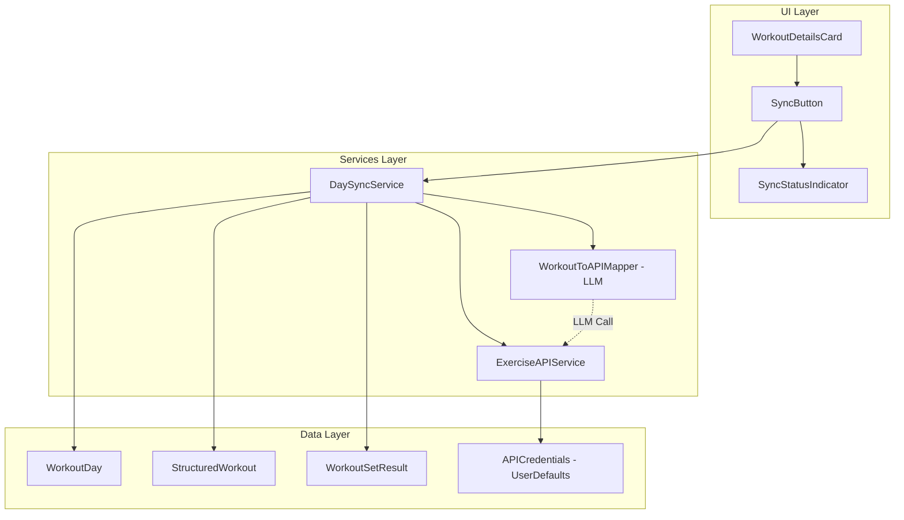

# Exercise API Sync Implementation Plan

## Overview

This plan outlines the implementation of a feature to sync workout data from individual day views to the Organizer Exercise API. The sync will be manually triggered per day and will replace (not merge) any existing data for that date on the server.

## Architecture Summary



## Key Design Decisions

1. **Credential Storage**: UserDefaults for simplicity - stores email and app password
2. **Data Mapping**: LLM-based mapping using GPT-5.2-mini via OpenRouter to semantically translate between app schema and API schema
3. **Sync Strategy**: Full replace - DELETE existing entry then recreate all data
4. **Error Handling**: Show user-friendly status with retry capability

## New Files to Create

### 1. ExerciseAPIService.swift
**Location**: `TrainerApp/TrainerApp/Services/ExerciseAPIService.swift`

Handles all HTTP communication with the Exercise API.

```swift
// Key responsibilities:
// - HTTP Basic Auth with stored credentials
// - CRUD operations for exercise entries
// - Strength exercises and sets
// - Cardio workouts and intervals
// - Yoga/mobility workouts and movements
// - Error handling and status codes
```

### 2. ExerciseAPIModels.swift
**Location**: `TrainerApp/TrainerApp/Models/ExerciseAPIModels.swift`

API-specific data models matching the Exercise API schema.

```swift
// Types to define:
// - DayPrimaryModality enum
// - CardioModality enum  
// - ExerciseEntryRequest/Response
// - StrengthExerciseRequest/Response
// - StrengthSetRequest/Response
// - CardioWorkoutRequest/Response
// - CardioIntervalRequest/Response
// - YogaMobilityRequest/Response
// - YogaMobilityMovementRequest/Response
```

### 3. WorkoutToAPIMapper.swift
**Location**: `TrainerApp/TrainerApp/Services/WorkoutToAPIMapper.swift`

LLM-based service to map app workout data to API format.

```swift
// Key responsibilities:
// - Build prompt with workout data and API schema
// - Call GPT-5.2-mini via OpenRouter
// - Parse JSON response into API models
// - Validate mapped data before returning
```

### 4. DaySyncService.swift
**Location**: `TrainerApp/TrainerApp/Services/DaySyncService.swift`

Orchestrates the sync process for a single day.

```swift
// Key responsibilities:
// - Coordinate data collection from WorkoutDay + Results
// - Call mapper service
// - Execute API calls in correct order
// - Handle rollback on partial failures
// - Report progress/status
```

### 5. ExerciseAPICredentials.swift
**Location**: `TrainerApp/TrainerApp/Services/ExerciseAPICredentials.swift`

Manages API credentials storage.

```swift
// Key responsibilities:
// - Store/retrieve email and password from UserDefaults
// - Validate password format (xxxx-xxxx-xxxx-xxxx-xxxx-xxxx)
// - Generate Basic Auth header
```

## Files to Modify

### 1. SettingsView.swift
**Add**: Organizer API credentials section

```swift
Section("Organizer API") {
    TextField("Email", text: $organizerEmail)
        .textContentType(.emailAddress)
        .autocapitalization(.none)
    
    SecureField("App Password", text: $organizerPassword)
        .textContentType(.password)
    
    Text("Generate app password in Organizer → Settings → App Passwords")
        .font(.caption)
        .foregroundColor(.secondary)
}
```

### 2. WeeklyCalendarView.swift - WorkoutDetailsCard
**Add**: Sync button to the workout details card

```swift
// In WorkoutDetailsCard body, add after ResultsSection:
if day.hasWorkout {
    SyncToOrganizerButton(day: day, scheduleManager: scheduleManager)
}
```

### 3. PersistenceKey.swift
**Add**: Keys for Organizer API credentials

```swift
enum OrganizerAPI {
    static let email = "OrganizerAPI_Email"
    static let password = "OrganizerAPI_Password"
}
```

## Implementation Details

### Phase 1: Foundation

#### ExerciseAPICredentials
```swift
class ExerciseAPICredentials {
    static let shared = ExerciseAPICredentials()
    
    private let emailKey = PersistenceKey.OrganizerAPI.email
    private let passwordKey = PersistenceKey.OrganizerAPI.password
    
    var email: String {
        get { UserDefaults.standard.string(forKey: emailKey) ?? "" }
        set { UserDefaults.standard.set(newValue, forKey: emailKey) }
    }
    
    var password: String {
        get { UserDefaults.standard.string(forKey: passwordKey) ?? "" }
        set { UserDefaults.standard.set(newValue, forKey: passwordKey) }
    }
    
    var hasCredentials: Bool {
        !email.isEmpty && !password.isEmpty
    }
    
    var basicAuthHeader: String {
        let credentials = "\(email):\(password)"
        let data = credentials.data(using: .utf8)!
        return "Basic \(data.base64EncodedString())"
    }
    
    func validatePasswordFormat(_ password: String) -> Bool {
        // xxxx-xxxx-xxxx-xxxx-xxxx-xxxx
        let pattern = "^[a-zA-Z0-9]{4}(-[a-zA-Z0-9]{4}){5}$"
        return password.range(of: pattern, options: .regularExpression) != nil
    }
}
```

#### ExerciseAPIService
```swift
class ExerciseAPIService {
    static let shared = ExerciseAPIService()
    
    private let baseURL = "https://organizer.dannyleffel.com/api/exercise"
    private let credentials = ExerciseAPICredentials.shared
    
    // MARK: - Exercise Entry Operations
    
    func deleteEntry(for date: Date) async throws {
        let dateString = formatDate(date)
        let url = URL(string: "\(baseURL)/entries/\(dateString)")!
        try await performRequest(url: url, method: "DELETE")
    }
    
    func createEntry(for date: Date, primaryModality: String?, notes: String?) async throws -> ExerciseEntryResponse {
        let dateString = formatDate(date)
        let url = URL(string: "\(baseURL)/entries/\(dateString)")!
        let body = ExerciseEntryRequest(primaryModality: primaryModality, dayNotes: notes)
        return try await performRequest(url: url, method: "PUT", body: body)
    }
    
    // MARK: - Strength Operations
    
    func addStrengthExercise(date: Date, exercise: StrengthExerciseRequest) async throws -> StrengthExerciseResponse {
        let dateString = formatDate(date)
        let url = URL(string: "\(baseURL)/entries/\(dateString)/strength")!
        return try await performRequest(url: url, method: "POST", body: exercise)
    }
    
    func addStrengthSet(exerciseId: String, set: StrengthSetRequest) async throws -> StrengthSetResponse {
        let url = URL(string: "\(baseURL)/strength/\(exerciseId)/sets")!
        return try await performRequest(url: url, method: "POST", body: set)
    }
    
    // MARK: - Cardio Operations
    
    func addCardioWorkout(date: Date, workout: CardioWorkoutRequest) async throws -> CardioWorkoutResponse {
        let dateString = formatDate(date)
        let url = URL(string: "\(baseURL)/entries/\(dateString)/cardio")!
        return try await performRequest(url: url, method: "POST", body: workout)
    }
    
    func addCardioInterval(workoutId: String, interval: CardioIntervalRequest) async throws -> CardioIntervalResponse {
        let url = URL(string: "\(baseURL)/cardio/\(workoutId)/intervals")!
        return try await performRequest(url: url, method: "POST", body: interval)
    }
    
    // MARK: - Yoga/Mobility Operations
    
    func setYogaMobility(date: Date, workout: YogaMobilityRequest) async throws -> YogaMobilityResponse {
        let dateString = formatDate(date)
        let url = URL(string: "\(baseURL)/entries/\(dateString)/yoga")!
        return try await performRequest(url: url, method: "PUT", body: workout)
    }
    
    func addYogaMovement(workoutId: String, movement: YogaMovementRequest) async throws -> YogaMovementResponse {
        let url = URL(string: "\(baseURL)/yoga/\(workoutId)/movements")!
        return try await performRequest(url: url, method: "POST", body: movement)
    }
    
    // MARK: - Private Helpers
    
    private func formatDate(_ date: Date) -> String {
        let formatter = DateFormatter()
        formatter.dateFormat = "yyyy-MM-dd"
        formatter.timeZone = TimeZone(identifier: "UTC")
        return formatter.string(from: date)
    }
    
    private func performRequest<T: Decodable, B: Encodable>(
        url: URL,
        method: String,
        body: B? = nil as String?
    ) async throws -> T {
        var request = URLRequest(url: url)
        request.httpMethod = method
        request.setValue(credentials.basicAuthHeader, forHTTPHeaderField: "Authorization")
        request.setValue("application/json", forHTTPHeaderField: "Content-Type")
        
        if let body = body {
            request.httpBody = try JSONEncoder().encode(body)
        }
        
        let (data, response) = try await URLSession.shared.data(for: request)
        
        guard let httpResponse = response as? HTTPURLResponse else {
            throw ExerciseAPIError.invalidResponse
        }
        
        switch httpResponse.statusCode {
        case 200...299:
            return try JSONDecoder().decode(T.self, from: data)
        case 401:
            throw ExerciseAPIError.notAuthenticated
        case 404:
            throw ExerciseAPIError.notFound
        default:
            throw ExerciseAPIError.httpError(httpResponse.statusCode)
        }
    }
}
```

### Phase 2: LLM-Based Data Mapping

#### WorkoutToAPIMapper
```swift
class WorkoutToAPIMapper {
    static let shared = WorkoutToAPIMapper()
    
    private let model = "openai/gpt-5.2-mini"
    
    func mapWorkoutToAPI(
        workoutDay: WorkoutDay,
        results: [WorkoutSetResult]
    ) async throws -> MappedDayData {
        
        let prompt = buildMappingPrompt(workoutDay: workoutDay, results: results)
        
        let response = try await callLLM(prompt: prompt)
        
        return try parseMappingResponse(response)
    }
    
    private func buildMappingPrompt(workoutDay: WorkoutDay, results: [WorkoutSetResult]) -> String {
        let encoder = JSONEncoder()
        encoder.outputFormatting = .prettyPrinted
        
        let workoutJSON = workoutDay.structuredWorkout.map { 
            try? String(data: encoder.encode($0), encoding: .utf8) 
        } ?? "null"
        
        let resultsJSON = (try? String(data: encoder.encode(results), encoding: .utf8)) ?? "[]"
        
        return """
        You are a data mapping assistant. Convert the following workout data from the TrainerApp format to the Organizer Exercise API format.

        ## Source Data

        ### Structured Workout Plan:
        \(workoutJSON ?? "No structured workout")

        ### Logged Results:
        \(resultsJSON)

        ## Target API Schema

        You must output valid JSON matching this structure:

        ```json
        {
            "entry": {
                "primaryModality": "strength|rowing|spinning|running|mobility|hiking|rest",
                "dayNotes": "string or null"
            },
            "strengthExercises": [
                {
                    "name": "string - exercise name",
                    "notes": "string or null - athlete notes",
                    "coachNotes": "string or null - coach prescription notes",
                    "displayOrder": 0,
                    "sets": [
                        {
                            "completed": true,
                            "reps": 8,
                            "load": 225,
                            "unit": "lb",
                            "rir": 2,
                            "notes": "string or null",
                            "targetReps": "8-10",
                            "targetLoad": "220-230",
                            "targetRir": "2-3",
                            "displayOrder": 0
                        }
                    ]
                }
            ],
            "cardioWorkouts": [
                {
                    "name": "string",
                    "modality": "rowing|spinning|running",
                    "notes": "string or null",
                    "coachNotes": "string or null",
                    "displayOrder": 0,
                    "intervals": [
                        {
                            "completed": true,
                            "durationSec": 1800,
                            "distanceM": 6000,
                            "paceSecPerKm": 300,
                            "cadence": 90,
                            "strokeRateSpm": 24,
                            "powerW": 180,
                            "avgHeartRate": 145,
                            "avgPowerW": 175,
                            "calories": 350,
                            "perceivedEffort": 6,
                            "notes": "string or null",
                            "targetDuration": "30:00",
                            "targetDistance": "6000",
                            "targetPace": "5:00",
                            "targetCadence": "24",
                            "targetHeartRate": "140-150",
                            "targetPower": "170-180",
                            "displayOrder": 0
                        }
                    ]
                }
            ],
            "yogaMobility": {
                "title": "string or null",
                "durationMin": 30,
                "focusAreas": ["hips", "spine"],
                "notes": "string or null",
                "coachNotes": "string or null",
                "targetDuration": "30",
                "movements": [
                    {
                        "name": "Pigeon Pose",
                        "reps": 3,
                        "completed": true
                    }
                ]
            }
        }
        ```

        ## Instructions:
        1. Map exercises by type - strength to strengthExercises, cardio to cardioWorkouts, yoga/mobility to yogaMobility
        2. Combine plan targets with logged results - use logged values for actual, plan values for targets
        3. Set completed=true for sets/intervals that have logged results
        4. Keep coachNotes for prescription info, notes for athlete feedback
        5. Determine primaryModality from the main focus of the workout
        6. Use null for optional fields that have no data
        7. Convert all weights to lb (unit: "lb")
        8. Convert times to seconds where needed
        9. Output ONLY valid JSON, no explanation

        JSON Output:
        """
    }
    
    private func callLLM(prompt: String) async throws -> String {
        let apiKey = AppConfiguration.shared.apiKey
        guard !apiKey.isEmpty else {
            throw MappingError.missingAPIKey
        }
        
        let url = URL(string: "https://openrouter.ai/api/v1/chat/completions")!
        var request = URLRequest(url: url)
        request.httpMethod = "POST"
        request.addValue("Bearer \(apiKey)", forHTTPHeaderField: "Authorization")
        request.addValue("application/json", forHTTPHeaderField: "Content-Type")
        request.addValue("TrainerApp", forHTTPHeaderField: "X-Title")
        
        let body: [String: Any] = [
            "model": model,
            "messages": [
                ["role": "user", "content": prompt]
            ],
            "response_format": ["type": "json_object"]
        ]
        
        request.httpBody = try JSONSerialization.data(withJSONObject: body)
        
        let (data, response) = try await URLSession.shared.data(for: request)
        
        guard let httpResponse = response as? HTTPURLResponse,
              (200...299).contains(httpResponse.statusCode) else {
            throw MappingError.llmError
        }
        
        let decoded = try JSONDecoder().decode(LLMResponse.self, from: data)
        return decoded.choices.first?.message.content ?? ""
    }
    
    private func parseMappingResponse(_ response: String) throws -> MappedDayData {
        guard let data = response.data(using: .utf8) else {
            throw MappingError.invalidResponse
        }
        return try JSONDecoder().decode(MappedDayData.self, from: data)
    }
}

// MARK: - Mapped Data Structures

struct MappedDayData: Codable {
    let entry: MappedEntry
    let strengthExercises: [MappedStrengthExercise]?
    let cardioWorkouts: [MappedCardioWorkout]?
    let yogaMobility: MappedYogaMobility?
}

struct MappedEntry: Codable {
    let primaryModality: String?
    let dayNotes: String?
}

struct MappedStrengthExercise: Codable {
    let name: String
    let notes: String?
    let coachNotes: String?
    let displayOrder: Int?
    let sets: [MappedStrengthSet]?
}

struct MappedStrengthSet: Codable {
    let completed: Bool?
    let reps: Int?
    let load: Double?
    let unit: String?
    let rir: Int?
    let notes: String?
    let targetReps: String?
    let targetLoad: String?
    let targetRir: String?
    let displayOrder: Int?
}

struct MappedCardioWorkout: Codable {
    let name: String
    let modality: String
    let notes: String?
    let coachNotes: String?
    let displayOrder: Int?
    let intervals: [MappedCardioInterval]?
}

struct MappedCardioInterval: Codable {
    let completed: Bool?
    let durationSec: Int?
    let distanceM: Int?
    let paceSecPerKm: Int?
    let cadence: Int?
    let strokeRateSpm: Int?
    let powerW: Int?
    let avgHeartRate: Int?
    let avgPowerW: Int?
    let calories: Int?
    let perceivedEffort: Int?
    let notes: String?
    let targetDuration: String?
    let targetDistance: String?
    let targetPace: String?
    let targetCadence: String?
    let targetHeartRate: String?
    let targetPower: String?
    let displayOrder: Int?
}

struct MappedYogaMobility: Codable {
    let title: String?
    let durationMin: Int?
    let focusAreas: [String]?
    let notes: String?
    let coachNotes: String?
    let targetDuration: String?
    let movements: [MappedYogaMovement]?
}

struct MappedYogaMovement: Codable {
    let name: String
    let reps: Int?
    let completed: Bool?
}
```

### Phase 3: Sync Orchestration

#### DaySyncService
```swift
class DaySyncService {
    static let shared = DaySyncService()
    
    private let apiService = ExerciseAPIService.shared
    private let mapper = WorkoutToAPIMapper.shared
    private let resultsManager = WorkoutResultsManager.shared
    
    enum SyncStatus {
        case idle
        case mapping
        case deletingExisting
        case creatingEntry
        case syncingStrength(Int, Int) // current, total
        case syncingCardio(Int, Int)
        case syncingYoga
        case complete
        case failed(Error)
    }
    
    @Published var status: SyncStatus = .idle
    
    func syncDay(_ workoutDay: WorkoutDay) async throws {
        let date = workoutDay.date
        
        // Step 1: Load results for this day
        let results = resultsManager.loadSetResults(for: date)
        
        // Step 2: Map data using LLM
        await MainActor.run { status = .mapping }
        let mappedData = try await mapper.mapWorkoutToAPI(
            workoutDay: workoutDay,
            results: results
        )
        
        // Step 3: Delete existing entry (if any)
        await MainActor.run { status = .deletingExisting }
        try? await apiService.deleteEntry(for: date)
        
        // Step 4: Create new entry
        await MainActor.run { status = .creatingEntry }
        let _ = try await apiService.createEntry(
            for: date,
            primaryModality: mappedData.entry.primaryModality,
            notes: mappedData.entry.dayNotes
        )
        
        // Step 5: Sync strength exercises
        if let strengthExercises = mappedData.strengthExercises {
            for (index, exercise) in strengthExercises.enumerated() {
                await MainActor.run { 
                    status = .syncingStrength(index + 1, strengthExercises.count)
                }
                
                let createdExercise = try await apiService.addStrengthExercise(
                    date: date,
                    exercise: StrengthExerciseRequest(
                        name: exercise.name,
                        notes: exercise.notes,
                        coachNotes: exercise.coachNotes,
                        displayOrder: exercise.displayOrder
                    )
                )
                
                // Add sets
                if let sets = exercise.sets {
                    for set in sets {
                        try await apiService.addStrengthSet(
                            exerciseId: createdExercise.id,
                            set: StrengthSetRequest(from: set)
                        )
                    }
                }
            }
        }
        
        // Step 6: Sync cardio workouts
        if let cardioWorkouts = mappedData.cardioWorkouts {
            for (index, workout) in cardioWorkouts.enumerated() {
                await MainActor.run { 
                    status = .syncingCardio(index + 1, cardioWorkouts.count)
                }
                
                let createdWorkout = try await apiService.addCardioWorkout(
                    date: date,
                    workout: CardioWorkoutRequest(
                        name: workout.name,
                        modality: workout.modality,
                        notes: workout.notes,
                        coachNotes: workout.coachNotes,
                        displayOrder: workout.displayOrder
                    )
                )
                
                // Add intervals
                if let intervals = workout.intervals {
                    for interval in intervals {
                        try await apiService.addCardioInterval(
                            workoutId: createdWorkout.id,
                            interval: CardioIntervalRequest(from: interval)
                        )
                    }
                }
            }
        }
        
        // Step 7: Sync yoga/mobility
        if let yoga = mappedData.yogaMobility {
            await MainActor.run { status = .syncingYoga }
            
            let createdYoga = try await apiService.setYogaMobility(
                date: date,
                workout: YogaMobilityRequest(from: yoga)
            )
            
            // Add movements
            if let movements = yoga.movements {
                for movement in movements {
                    try await apiService.addYogaMovement(
                        workoutId: createdYoga.id,
                        movement: YogaMovementRequest(from: movement)
                    )
                }
            }
        }
        
        await MainActor.run { status = .complete }
    }
}
```

### Phase 4: UI Components

#### SyncToOrganizerButton
```swift
struct SyncToOrganizerButton: View {
    let day: WorkoutDay
    @ObservedObject var scheduleManager: TrainingScheduleManager
    
    @State private var isSyncing = false
    @State private var syncError: Error?
    @State private var showError = false
    @State private var showSuccess = false
    @State private var showCredentialsAlert = false
    @StateObject private var syncService = DaySyncService.shared
    
    var body: some View {
        VStack(spacing: 8) {
            Button {
                performSync()
            } label: {
                HStack {
                    if isSyncing {
                        ProgressView()
                            .scaleEffect(0.8)
                        Text(statusText)
                    } else if showSuccess {
                        Image(systemName: "checkmark.circle.fill")
                            .foregroundColor(.green)
                        Text("Synced to Organizer")
                    } else {
                        Image(systemName: "arrow.triangle.2.circlepath")
                        Text("Sync to Organizer")
                    }
                }
                .font(.subheadline.weight(.medium))
                .frame(maxWidth: .infinity)
                .padding(.vertical, 12)
                .background(backgroundColor)
                .foregroundColor(foregroundColor)
                .cornerRadius(10)
            }
            .disabled(isSyncing)
        }
        .alert("Organizer Credentials Required", isPresented: $showCredentialsAlert) {
            Button("Open Settings") {
                // Navigate to settings
            }
            Button("Cancel", role: .cancel) {}
        } message: {
            Text("Please configure your Organizer email and app password in Settings.")
        }
        .alert("Sync Failed", isPresented: $showError) {
            Button("Retry") {
                performSync()
            }
            Button("Cancel", role: .cancel) {}
        } message: {
            Text(syncError?.localizedDescription ?? "Unknown error occurred")
        }
    }
    
    private var statusText: String {
        switch syncService.status {
        case .mapping:
            return "Preparing data..."
        case .deletingExisting:
            return "Clearing old data..."
        case .creatingEntry:
            return "Creating entry..."
        case .syncingStrength(let current, let total):
            return "Syncing strength \(current)/\(total)..."
        case .syncingCardio(let current, let total):
            return "Syncing cardio \(current)/\(total)..."
        case .syncingYoga:
            return "Syncing mobility..."
        default:
            return "Syncing..."
        }
    }
    
    private var backgroundColor: Color {
        if showSuccess {
            return Color.green.opacity(0.15)
        }
        return Color.accentColor.opacity(0.15)
    }
    
    private var foregroundColor: Color {
        if showSuccess {
            return .green
        }
        return .accentColor
    }
    
    private func performSync() {
        guard ExerciseAPICredentials.shared.hasCredentials else {
            showCredentialsAlert = true
            return
        }
        
        isSyncing = true
        showSuccess = false
        
        Task {
            do {
                try await syncService.syncDay(day)
                await MainActor.run {
                    isSyncing = false
                    showSuccess = true
                    
                    // Reset success indicator after 3 seconds
                    DispatchQueue.main.asyncAfter(deadline: .now() + 3) {
                        showSuccess = false
                    }
                }
            } catch {
                await MainActor.run {
                    isSyncing = false
                    syncError = error
                    showError = true
                }
            }
        }
    }
}
```

## Testing Strategy

### Unit Tests
1. **ExerciseAPICredentials**: Test password format validation, auth header generation
2. **WorkoutToAPIMapper**: Test prompt generation, response parsing
3. **ExerciseAPIService**: Mock network responses, test all endpoints

### Integration Tests
1. Test full sync flow with mock API
2. Test error handling and recovery
3. Test partial failure scenarios

### Manual Testing
1. Sync a day with only strength exercises
2. Sync a day with mixed modalities
3. Sync a day with logged results
4. Sync a day with no data (should handle gracefully)
5. Test with invalid credentials
6. Test with network errors

## Error Handling

```swift
enum ExerciseAPIError: LocalizedError {
    case notAuthenticated
    case notFound
    case httpError(Int)
    case invalidResponse
    case encodingError
    
    var errorDescription: String? {
        switch self {
        case .notAuthenticated:
            return "Invalid credentials. Check your email and app password in Settings."
        case .notFound:
            return "Resource not found."
        case .httpError(let code):
            return "Server error (HTTP \(code)). Please try again."
        case .invalidResponse:
            return "Invalid response from server."
        case .encodingError:
            return "Failed to encode request data."
        }
    }
}

enum MappingError: LocalizedError {
    case missingAPIKey
    case llmError
    case invalidResponse
    
    var errorDescription: String? {
        switch self {
        case .missingAPIKey:
            return "OpenRouter API key not configured. Set it in Settings."
        case .llmError:
            return "Failed to map workout data. Please try again."
        case .invalidResponse:
            return "Invalid mapping response. Please try again."
        }
    }
}
```

## Implementation Order

1. **Phase 1** - Foundation (1 file)
   - [ ] `ExerciseAPICredentials.swift`
   - [ ] Add credentials to `PersistenceKey.swift`
   - [ ] Add credentials UI to `SettingsView.swift`

2. **Phase 2** - API Layer (2 files)
   - [ ] `ExerciseAPIModels.swift`
   - [ ] `ExerciseAPIService.swift`

3. **Phase 3** - Mapping Layer (1 file)
   - [ ] `WorkoutToAPIMapper.swift`

4. **Phase 4** - Orchestration (1 file)
   - [ ] `DaySyncService.swift`

5. **Phase 5** - UI Integration (2 files)
   - [ ] Create `SyncToOrganizerButton.swift` in `Views/Shared/`
   - [ ] Integrate button into `WeeklyCalendarView.swift`

6. **Phase 6** - Testing & Polish
   - [ ] End-to-end testing
   - [ ] Error message refinement
   - [ ] Loading state animations

## Notes

- The LLM mapping approach provides flexibility to handle schema differences and edge cases
- GPT-5.2-mini is used for cost-efficiency while maintaining quality
- Full replace strategy avoids complex merge logic and ensures consistency
- Sync status is shown inline to provide feedback without blocking UI
